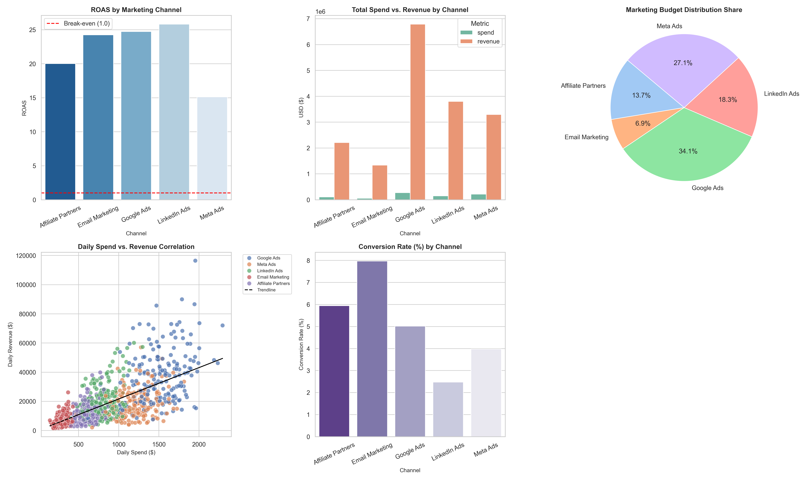
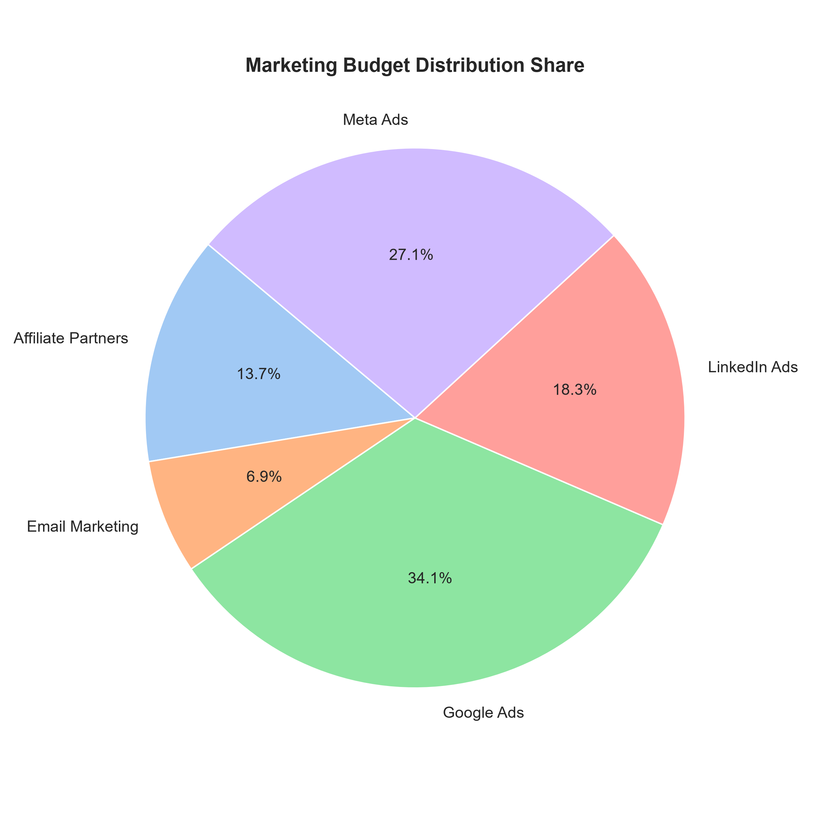
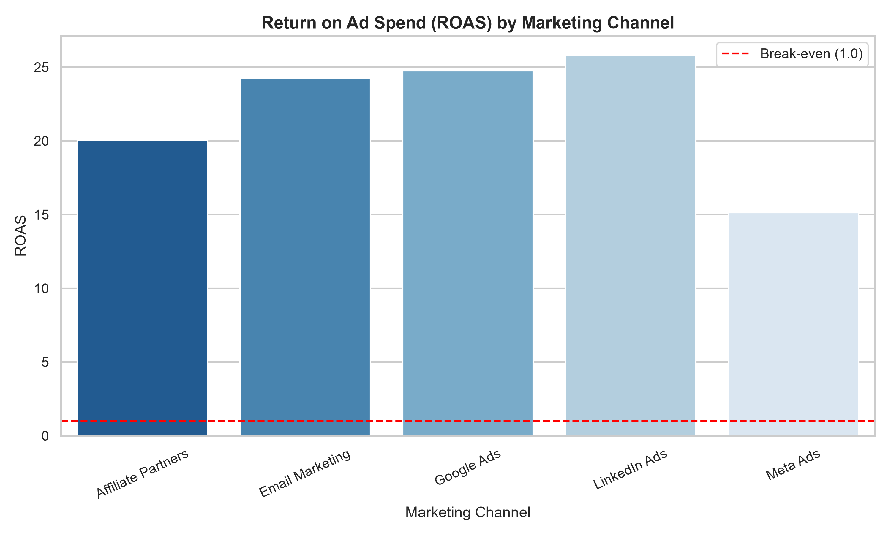
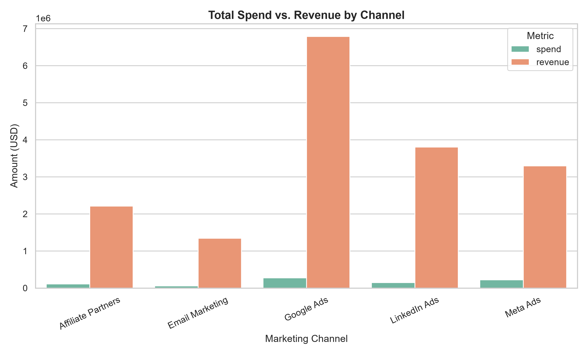
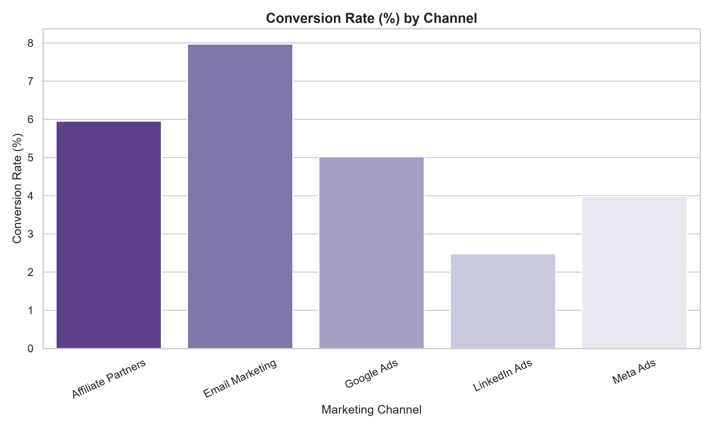

# Marketing ROI & Multi-Channel Performance Analysis

An end-to-end marketing analytics engine designed to evaluate multi-channel advertising efficiency, customer acquisition costs (CAC), return on ad spend (ROAS), and conversion funnel performance using Python and SQL.

---

## Executive Marketing Dashboard


---

## Visual Insights & Channel Breakdown

| Budget Distribution | ROAS by Acquisition Channel |
| :---: | :---: |
|  |  |

| Spend vs. Revenue Correlation | Conversion Velocity by Channel |
| :---: | :---: |
|  |  |

---

## Core Analytics & Features

- **Multi-Source Data Consolidation:** Ingests raw advertising spend (impressions, clicks, spend) and conversion pipeline transactions across Google Ads, Meta Ads, LinkedIn Ads, Email, and Affiliate channels.
- **Unit Economics Modeling:** Computes Customer Acquisition Cost (CAC), Return on Ad Spend (ROAS), Cost per Click (CPC), and Click-Through Rates (CTR).
- **SQL Analytics Engine:** Aggregates channel performance, conversion benchmarks, and spend efficiencies using optimized SQL queries.
- **Automated Visualization Suite:** Generates executive-ready dashboards, spend-vs-revenue correlation scatter plots, and allocation pie charts.

---

## Tech Stack

- **Language:** Python
- **Database / Query Engine:** MySQL / SQLite
- **Libraries:** Pandas, NumPy, Matplotlib, Seaborn, SQLAlchemy

---

## Repository Structure

```text
├── data/                                # Raw & processed marketing datasets
│   ├── consolidated_campaign_data.csv
│   ├── raw_marketing_spend.csv
│   └── raw_sales_data.csv
├── notebooks/                           # Jupyter exploratory workflows
│   └── exploratory_analysis.ipynb
├── outputs/                             # Exported figures & dashboard artifacts
│   ├── marketing_performance_dashboard.png
│   ├── budget_share_pie_chart.png
│   ├── channel_performance.png
│   ├── conversion_rate_by_channel.png
│   ├── roas_by_channel.png
│   └── spend_vs_revenue.png
├── sql/                                 # Schema definitions & analytical queries
│   ├── schema.sql
│   └── queries.sql
├── src/                                 # Data pipeline & modeling modules
│   ├── analysis.py
│   └── data_pipeline.py
├── requirements.txt
└── README.md
